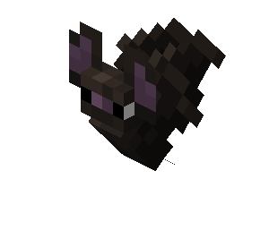

<table border="0">
  <tr>
    <td width="55%" valign="top" align="center">
      
       
      

         
        $\color{#FF0000}{\text{── † 𝓒𝓛𝓞𝓦𝓝𝓩𝓨 † ──}}$
        
      

      
       
      

        $\color{#D32F2F}{\text{"𝓘'𝓶 𝓭𝓮𝓬𝓲𝓭𝓮𝓭 𝓘'𝓶 𝓰𝓸𝓷𝓷𝓪 𝓴𝓮𝓮𝓹 𝔂𝓸𝓾 𝓱𝓮𝓻𝓮 𝓯𝓸𝓻𝓮𝓿𝓮𝓻"}}$
         
        $\color{#B71C1C}{\text{"𝓒𝓪𝓷 𝔀𝓮 𝓪𝓵𝔀𝓪𝔂𝓼 𝓫𝓮 𝓽𝓱𝓲𝓼 𝓬𝓵𝓸𝓼𝓮... 𝓯𝓸𝓻𝓮𝓿𝓮𝓻 𝓪𝓷𝓭 𝓮𝓿𝓮𝓻?"}}$
      

      

        
        
      

           
        
    </td>
    <td width="45%" valign="middle" align="right">
       
    </td>
  </tr>
</table>
